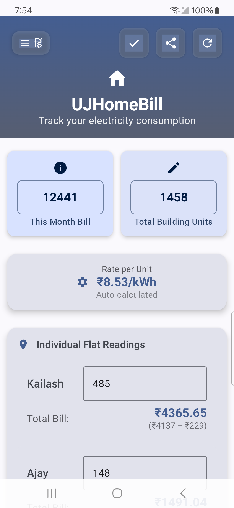

# UJHomeBill - Electricity Bill Calculator

[](https://android.com)
[](https://kotlinlang.org)
[](https://developer.android.com/jetpack/compose)
[]()

A modern Android application built with Jetpack Compose for calculating and managing electricity bills across multiple flats in a building. Perfect for apartment buildings, housing societies, and shared living spaces.

## 📱 Screenshots



## ✨ Features

### 🏠 **Multi-Flat Bill Management**
- Calculate electricity bills for 5 flats (Kailash, Ajay, Manoj, Rakesh, Ramesh)
- **Previous & Current Unit Tracking** - Track meter readings month-over-month
- Automatic rate calculation based on total bill and units
- Units consumed = Current Reading - Previous Reading

### 💾 **Offline Database Storage** *(New in v2.0)*
- **Room Database** for persistent local storage
- Saves all bill records with complete details
- **Auto-saves previous readings** - Next month auto-fills from database
- View historical bill data in Settings
- No internet required - fully offline app

### 📋 **Other Common Bills** *(New in v2.0)*
- Add additional shared bills (Water, Maintenance, etc.)
- Automatically divided equally among all flats
- Included in final bill calculation
- Supports multiple bills per month

### ⚡ **Smart Calculations**
- **Auto Rate Calculation**: Rate per unit (₹/kWh) from total bill and units
- **Common Area Distribution**: Fair distribution across all flats
- **Other Bills Share**: Additional bills split equally
- **Real-time Updates**: Instant calculation as you type
- **Final Bill** = Electricity Usage + Common Area Share + Other Bills Share

### ⚙️ **Settings & Analytics** *(New in v2.0)*
- **User Profile**: Set your name, view stats
- **Yearly Analytics**: 
  - Total yearly bill amount
  - Average monthly bill
  - Total units consumed
  - Average rate per kWh
  - Monthly breakdown table
- **All Years Summary**: Compare year-over-year
- **Password-Protected Data Deletion**: Password `1234` to clear database

### 🌐 **Bilingual Support**
- **Hindi & English**: Complete bilingual interface
- Easy language toggle with EN/हिं button
- Settings page also supports both languages

### 📄 **Export & Share Options**
- **PDF Generation**: Professional PDF bills
- **Auto-Save on Share**: Saves to database when sharing
- **Confirmation Dialog**: Ensures correct data before saving
- **Share via**: WhatsApp, Email, SMS, etc.

## 🎨 **UI Design**

### **Clean Blue/White Theme**
- **Primary Blue**: `#1E88E5`
- **White Cards** with subtle shadows
- **Light Gray Background**: `#F5F5F5`
- Consistent across all screens
- Works in both Light and Dark mode

### **Modern Components**
- Material Design 3
- Centered input fields
- Proper focus states
- Edge-to-edge display

## 📋 **How to Use**

### Monthly Bill Entry:
1. **Enter Total Bill**: Monthly electricity bill amount (₹)
2. **Enter Building Units**: Total building consumption (kWh)
3. **Previous Units**: Auto-filled from last month (editable if needed)
4. **Current Units**: Enter current meter reading for each flat
5. **Add Other Bills** (optional): Water, Maintenance, etc.
6. **Share**: Tap Share → Confirm → Data saves & shares

### Settings:
1. Tap ⚙️ icon to open Settings
2. Set your name
3. View yearly analytics
4. Select year to see monthly breakdown
5. Delete all data (password: `1234`)

## 🔢 **Calculation Logic**

```
Rate per Unit = Total Bill ÷ Total Building Units

Units Consumed (per flat) = Current Reading - Previous Reading

Common Area Units = Building Total - Sum of All Flat Units
Common Area Cost per Flat = (Common Area Units × Rate) ÷ 5

Other Bills per Flat = Total Other Bills ÷ 5

Final Flat Bill = (Units Consumed × Rate) + Common Area Share + Other Bills Share
```

## 📤 **Sample Share Output**

### **English:**
```
🏠 UJHomeBill - Electricity Bill Summary
=========================================

📊 Units Breakdown:
• Total Flat Units: 250 kWh
• Building Total Units: 300 kWh
• Common Area Units: 50 kWh
• Rate per Unit: ₹8.00/kWh

📋 Other Common Bills:
• Water: ₹500 (₹100.00/flat)

💰 Flat-wise Bills:
Kailash: 40→90 = 50 kWh
   ₹580.00 (₹400 + ₹180)
Ajay: 100→150 = 50 kWh
   ₹580.00 (₹400 + ₹180)
...

🏢 Additional Costs (Per Flat):
• Common Area Electricity: ₹80.00
• Other Bills: ₹100.00
• Total Additional: ₹180.00

💡 Note: Each flat's final bill = Electricity usage + Common area + Other bills
```

## 🛡️ **Data Privacy**

- **100% Offline**: No data sent to servers
- **Local Storage**: All data stored on device only
- **No Permissions Required**: Uses app-private storage
- **Secure Delete**: Password-protected data deletion

## 🔧 **Technical Details**

| Component | Technology |
|-----------|------------|
| Platform | Android (API 24+) |
| Language | Kotlin |
| UI Framework | Jetpack Compose |
| Database | Room Persistence Library |
| Architecture | MVVM with ViewModel |
| Navigation | Jetpack Navigation Compose |
| Design | Material Design 3 |
| Min SDK | 24 (Android 7.0) |
| Target SDK | 35 (Android 15) |

## 📦 **Project Structure**

```
com.uj.homebill/
├── MainActivity.kt          # Main screen with bill calculator
├── data/
│   ├── database/
│   │   ├── AppDatabase.kt   # Room database configuration
│   │   ├── BillDao.kt       # Data Access Object
│   │   └── Entities.kt      # Database entities
│   └── repository/
│       └── BillRepository.kt # Repository pattern
├── screens/
│   └── SettingsScreen.kt    # Settings & Analytics
├── viewmodel/
│   └── BillViewModel.kt     # ViewModel for UI state
└── ui/theme/
    ├── Color.kt             # Blue/White theme colors
    ├── Theme.kt             # Material theme
    └── Type.kt              # Typography
```

## 📱 **Compatibility**

- Android 7.0 (API 24) and above
- Optimized for modern devices
- Responsive design for various screen sizes
- Portrait orientation
- No storage permissions needed

## 🎯 **Use Cases**

- **Apartment Buildings**: Split bills among residents
- **Housing Societies**: Manage common area costs
- **Shared Housing**: Fair distribution among roommates
- **Property Management**: Professional billing for tenants
- **Family Buildings**: Track consumption across family members

## 📝 **Version History**

### v2.0 (Current)
- ✅ Offline database storage (Room)
- ✅ Previous/Current unit tracking
- ✅ Auto-save on share
- ✅ Settings page with analytics
- ✅ Other common bills feature
- ✅ Yearly analytics & breakdown
- ✅ Clean blue/white theme
- ✅ Password-protected data deletion
- ✅ Bilingual settings page

### v1.0
- Basic bill calculation
- PDF generation
- Share functionality
- Hindi/English support

---

**Made with ❤️ for better bill management**
